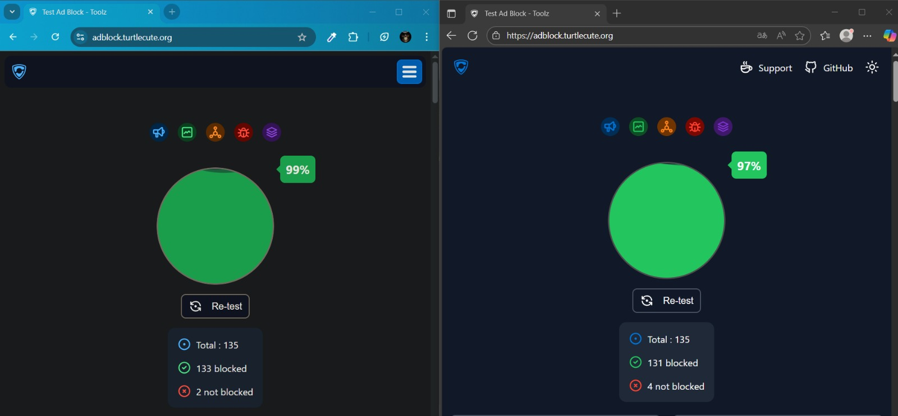
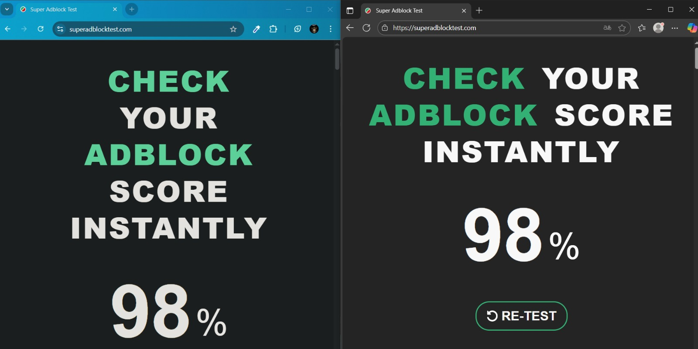
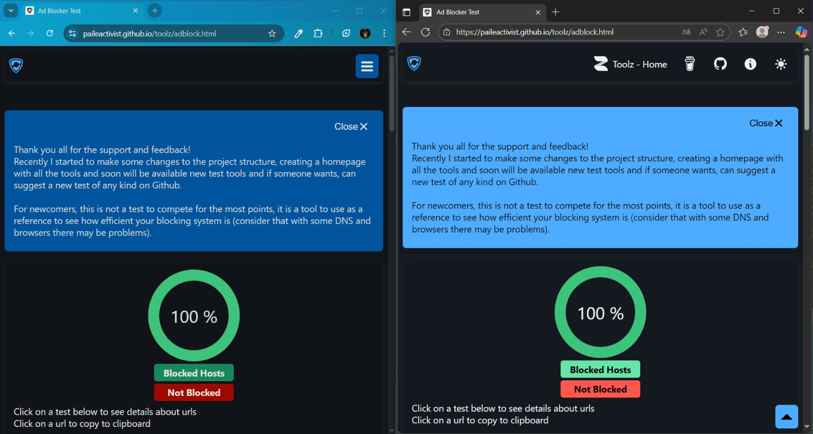
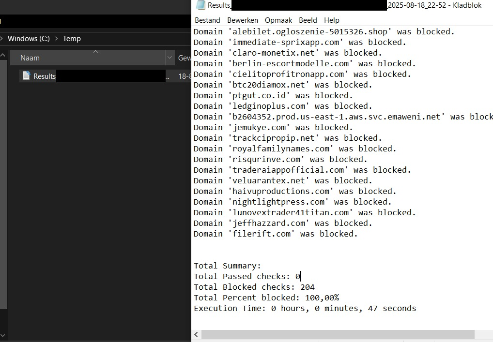

# Unifi Ultimate Blocklist

This repository provides a **comprehensive blocklist** for the **Content Filter** option in **Unifi**.  
It is designed to block most, if not all, recently known **ads, malware, trackers, spyware, and pirate sites**.

The blocklist is maintained in [`Unifi ultimate blocklist.txt`](./Unifi%20ultimate%20blocklist.txt), which you can either:

- **Download and upload** directly into the Unifi Controller under the Content Filter Blocklist, or  
- **Copy-paste the raw contents** into the Content Filter Blocklist field in your Unifi settings.

---

## ✅ Testing & Verification

To ensure the blocklist works as intended, it has been tested with the following tools across **Edge** and **Chrome** browsers:

- [Turtlecute Adblock Test](https://adblock.turtlecute.org/)  
- [Super Adblock Test](https://superadblocktest.com/)  
- [Ad Blocker Test](https://paileactivist.github.io/toolz/adblock.html)  
- [Network Protection Tester](https://itproexpert.com/network-protection-tester/)

---

## 📸 Test Results

### Turtlecute Adblock Test

### Super Adblock Test

### Ad Blocker Test

### Network Protection Tester

---

## 📥 How to Use

1. Download [`Unifi ultimate blocklist.txt`](./Unifi%20ultimate%20blocklist.txt).  
2. Go to your **Unifi Controller** → **Settings** → **Internet Security** → **Content Filtering**.  
3. Enable **Custom Blocklist**.  
4. Either:
   - Upload the `.txt` file, **or**
   - Copy the raw text and paste it into the **Blocklist** field.  
5. Save & apply changes.

---

## 🛡️ Features

- Blocks **ads** across the majority of known networks.  
- Protects against **malware, trackers and spyware** domains.  
- Prevents access to **pirate and illegal streaming sites**.  
- Works seamlessly with Unifi’s **built-in Content Filter**.

---

## ⚠️ Disclaimer

This blocklist is provided **as-is**. While it blocks a wide range of unwanted domains, false positives may occur.  
Use at your own discretion and adjust the blocklist according to your network needs.
